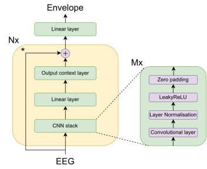
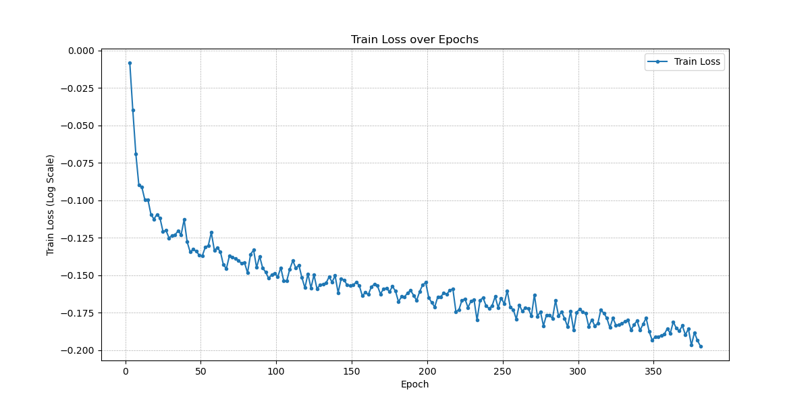
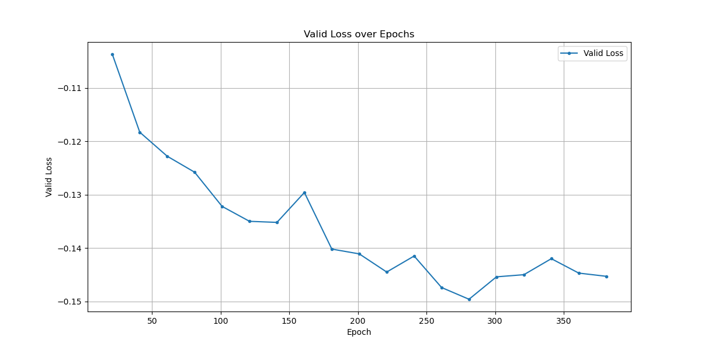
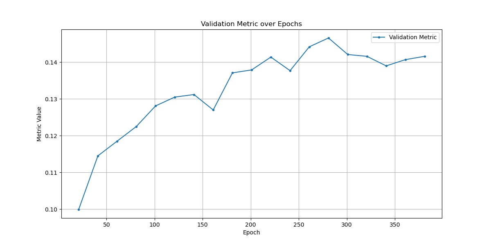
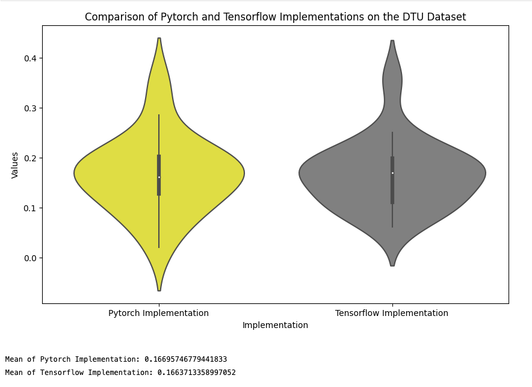

# VLAAI-pytorch
 
 ## Decoding of the speech envelope using the VLAAI deep neural network. (Unofficial) PyTorch implementation.
=============================================================================

This repository contains a pre-trained subject-independent model that can
decode the speech envelope from EEG signals. The model was presented in the 
paper: [Decoding of the speech envelope using the VLAAI deep neural network](./#)

by [Bernd Accou](https://gbiomed.kuleuven.be/english/research/50000666/50000672/people/members/00114712), [Jonas Vanthornhout](https://gbiomed.kuleuven.be/english/research/50000666/50000672/people/members/00077061), [Hugo Van hamme](https://www.kuleuven.be/wieiswie/en/person/00040707), and [Tom Francart](https://gbiomed.kuleuven.be/english/research/50000666/50000672/people/members/00046624).

This repository contains an unofficial PyTorch implementation of the VLAAI network. 

# Logs and results

Pre-trained model versions (using the preprocessing and dataset (
single-speaker stories dataset, 85 subjects that listened to 1 hour and 46 
minutes on average for a total of 144 hours of EEG data) in the 
[paper](./#)) are available in the [pretrained_models](./checkpoints) folder.

# Performance Comparison with the original TensorFlow implementation on the DTU test set

Original TensorFlow implementation: [Here](https://github.com/exporl/vlaai)

